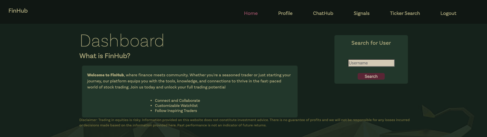
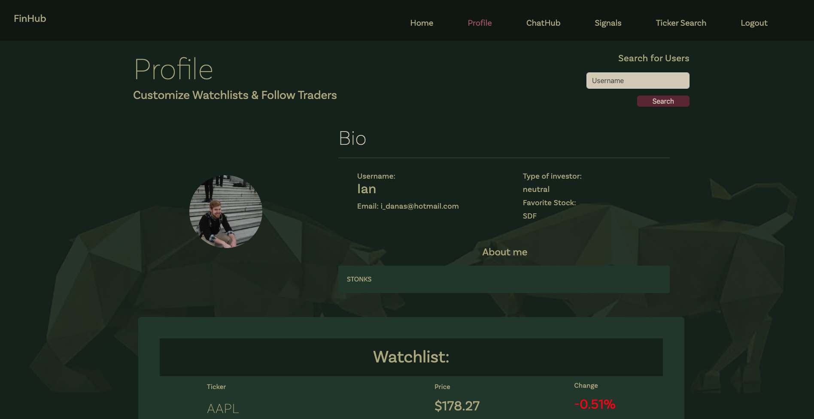
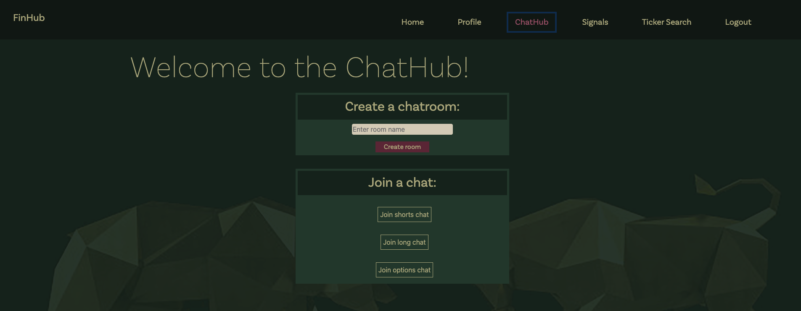
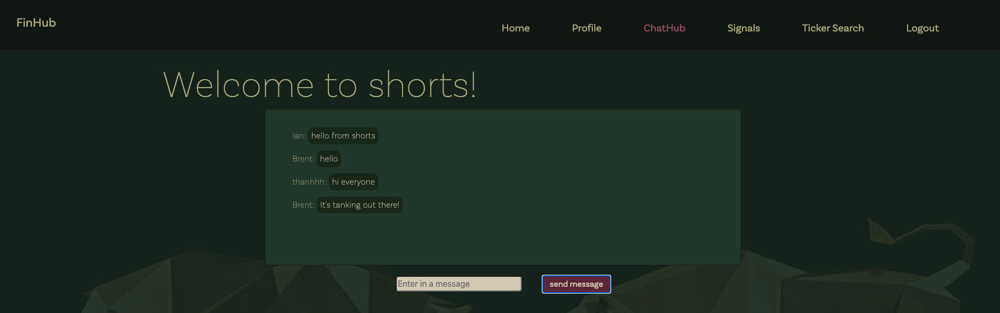
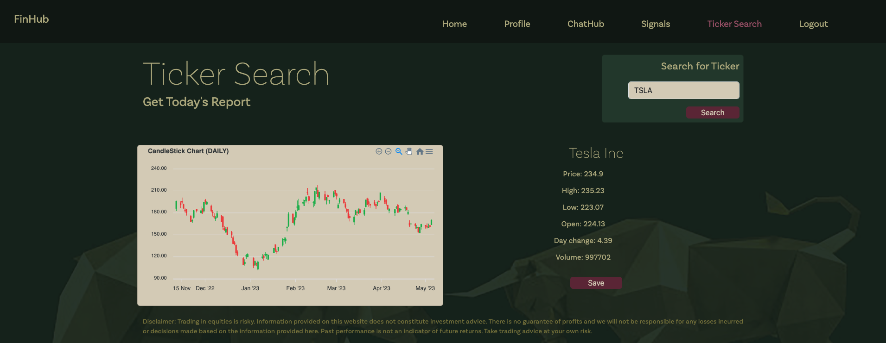
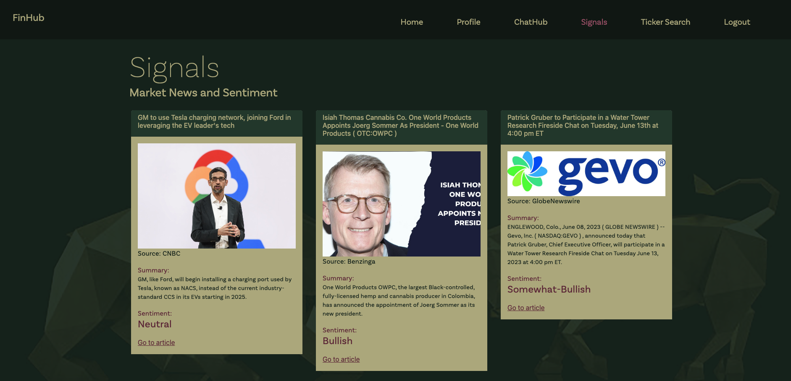

# FinHub

## Description

FinHub is a social media platform built by the investing community for the investing community. We strive to create a space where individuals can share their thoughts and ideas with other in the community. Users can create profiles for themselves when they sign up and add stocks to their watch list for other to come view their profile and watchlist. Users are able to look up tickers and get intra-day stock information to better analyze if those tickers are deserving of join their watch list. As FinHub is focused on building connections and sharing ideas, users can go into ChatHub where users can join topic specific chat rooms to live chat with other users!

Disclaimer: FinHub is not a resource for financial advice and does not provide financial advice. Please consult a financial and tax professional for any questions or advice.

## User Story

```md
AS AN avid investor and follower of the stock market
I WANT TO be able to connect with members of the investing community
SO THAT we can share ideas, connect, and make money!
```

## Installation

N/A

## Usage

To use this application, follow this link: https://finnhub.netlify.app

## Screenshots















## Credits

Henry Weigand - UW Bootcamp TA

Matthew Tudor - UW Bootcamp TA

Eli Wood - UW Bootcamp TA

Morgan Tolman - UW Bootcamp TA

Sophie LeBron - UW Bootcamp TA

## License

MIT License

        
Copyright (c) 2023 Ian Danas, Thanh Hoang, Brent Houston, Alex Moriyama.
        
Permission is hereby granted, free of charge, to any person obtaining a copy of this software and associated
documentation files (the "Software"), to deal in the Software without restriction, including without limitation
the rights to use, copy, modify, merge, publish, distribute, sublicense, and/or sell copies of the Software, and
to permit persons to whom the Software is furnished to do so, subject to the following conditions:

The above copyright notice and this permission notice shall be included in all copies or substantial portions
of the Software.

THE SOFTWARE IS PROVIDED "AS IS", WITHOUT WARRANTY OF ANY KIND, EXPRESS OR IMPLIED, INCLUDING BUT NOT LIMITED TO 
THE WARRANTIES OF MERCHANTABILITY, FITNESS FOR A PARTICULAR PURPOSE AND NONINFRINGEMENT. IN NO EVENT SHALL THE 
AUTHORS OR COPYRIGHT HOLDERS BE LIABLE FOR ANY CLAIM, DAMAGES OR OTHER LIABILITY, WHETHER IN AN ACTION OF CONTRACT,
TORT OR OTHERWISE, ARISING FROM, OUT OF OR IN CONNECTION WITH THE SOFTWARE OR THE USE OR OTHER DEALINGS IN THE SOFTWARE.